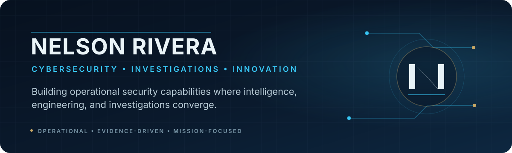

<div align="center">



<br/>

**Cybersecurity Executive · Threat Intelligence · Investigations · Security Engineering**

Former U.S. Postal Inspector · Retired U.S. Coast Guard Officer · Black Hat Speaker · Patent Holder

<br/>


</div>

---

## I build security programs.

For more than two decades, I have worked at the intersection of **cybersecurity, intelligence, investigations, engineering, and operational leadership**. My focus is converting difficult security problems into capabilities that teams can actually operate: intelligence programs, investigative workflows, malware-analysis environments, deception systems, cryptographic security, and automation.

I am particularly interested in problems where the answer is not another dashboard or report, but a better operational system.

### Areas of focus

| Domain | Focus |
| --- | --- |
| **Threat Intelligence** | Nation-state threats, intelligence operations, threat hunting, collection and analysis |
| **Investigations** | Cybercrime, intrusion investigations, complex investigative operations |
| **Security Engineering** | Malware analysis, sandboxing, deception, automation, secure infrastructure |
| **Cryptographic Security** | Key management, HSMs, cryptographic controls, post-quantum readiness |
| **Leadership** | Building teams, programs, operating models, and durable security capabilities |

---

## Open-source work

### [CAPEv2](https://github.com/nyrivera/CAPEv2)

I contribute to **CAPEv2**, an open-source malware analysis sandbox. Current work includes extending the platform toward Android guest analysis and improving the path from sample submission through install, launch, and process-lifetime observation.

**Upstream contribution:** [Add first-phase Android guest analyzer — CAPEv2 #3210](https://github.com/kevoreilly/CAPEv2/pull/3210)

---

## How I approach the work

```text
Evidence over assumption.
Operational capability over slideware.
Automation where it improves judgment, not where it replaces it.
Build for the analyst, investigator, and operator who has to use it at 2:00 AM.
```

---

<div align="center">

### Security is an operational discipline.

<sub>GitHub: <a href="https://github.com/nyrivera">@nyrivera</a></sub>

</div>
